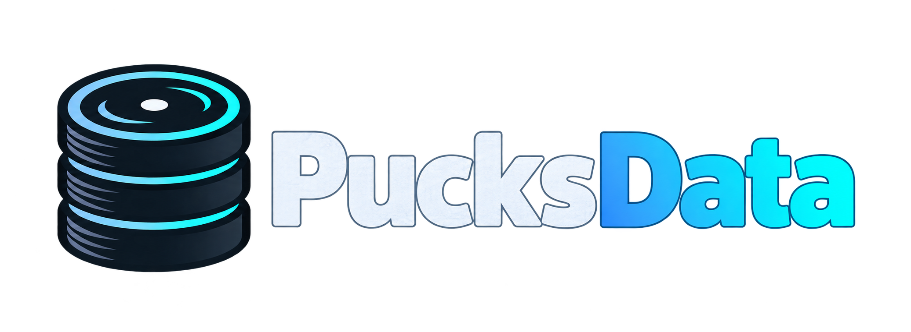
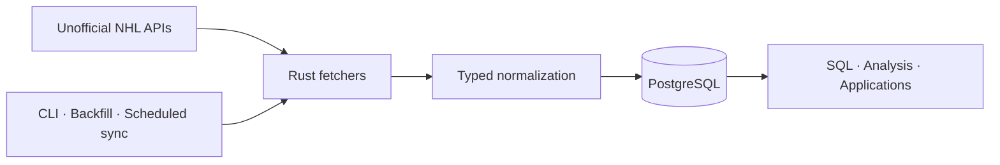

<h1 align="center">
  
</h1>

<p align="center">
  <a href="https://github.com/jberezow/pucksdata/actions/workflows/ci.yml"></a>
  <a href="https://github.com/jberezow/pucksdata/actions/workflows/canary.yml"></a>
  <a href="LICENSE"></a>
  <a href="https://www.rust-lang.org/"></a>
</p>

PucksData fetches NHL data and turns it into a queryable PostgreSQL database.
Written in Rust, it supports historical backfills and scheduled updates for
hockey analysis, visualizations, applications and machine-learning datasets.

It stores teams, players, schedules, play-by-play events, shifts and official
player statistics. Ingestion tracks failures, retries missing games, checks
recent results for corrections and retains timestamped source observations and
normalized revisions. Analysis and prediction belong in downstream tools.

## How it works


```mermaid
flowchart LR
    NHL[Unofficial NHL APIs] --> Fetch[Rust fetchers]
    Fetch --> Normalize[Typed normalization]
    Normalize --> PG[(PostgreSQL)]
    CLI[CLI · Backfill · Scheduled sync] --> Fetch
    PG --> Readers[SQL · Analysis · Applications]
```

Writes are transactional and repeatable. Backfills track per-game progress;
`status` reports coverage and ingestion problems. The daemon performs the same
sync as the CLI on a configurable interval.

## Quick start

You need a stable [Rust toolchain](https://rustup.rs/), PostgreSQL 14 or newer,
and the PostgreSQL-enabled migration CLI:

```bash
cargo install sqlx-cli --version 0.9.0 --locked --no-default-features --features rustls,postgres
git clone https://github.com/jberezow/pucksdata.git
cd pucksdata
cp .env.example .env
```

Create an empty PostgreSQL database, then set `DATABASE_URL` and
`MIGRATION_DATABASE_URL` in `.env`. Both can use the same local database; hosted installations should use a restricted ingestion connection
for the former and a schema-owner connection for the latter.

For a new database:

```bash
./scripts/run-migrations.sh
cargo install --path .
```

Before ingestion, complete the [Winnipeg seed reconciliation](docs/team-attribution.md#winnipeg-audit-and-repair).
The migration seed predates the NHL's updated franchise attribution; the runtime
checks that mapping before accepting data. Existing installations should follow
[the upgrade guide](OPERATIONS.md#upgrading-an-existing-database).

Load the entity catalogue and a season of games, then its events:

```bash
pucksdata fetch teams
pucksdata fetch seasons
pucksdata fetch games --season 20252026
pucksdata fetch players
pucksdata backfill --season 20252026
pucksdata status --season 20252026
```

These commands can be restarted safely. Use `fetch games --all` followed by
`backfill` for the full historical event archive. Official statistics and shifts
have separate commands below.

## Commands

Run `pucksdata --help` or `pucksdata <COMMAND> --help` for all options.
Seasons use the NHL's eight-digit format, such as `20252026` for 2025–26.

| Command | Purpose |
| --- | --- |
| `fetch teams` / `fetch seasons` / `fetch players` | Refresh entities and current roster observations |
| `fetch games --season 20252026` | Load one season's schedule and game metadata |
| `fetch games --all` | Load game metadata across available seasons |
| `fetch events 2025020001` | Load one game's play-by-play |
| `backfill --season 20252026` | Resume missing historical event loads |
| `backfill --season 20252026 --refresh` | Re-fetch and replace a season's event snapshots |
| `fetch official-stats --season 20252026` | Load official skater and goalie season totals; omit the season for all seasons |
| `fetch official-game-stats --game 2025020001` | Load a completed game's official player statistics |
| `fetch official-game-stats --from 2026-01-01 --to 2026-01-31` | Load or audit completed games in an inclusive date range |
| `sync` | Refresh metadata, fill event gaps and check recent completed games for corrections |
| `sync --from 2026-01-01` | Recheck completed games from a date, including existing events |
| `daemon --interval-secs 21600` | Sync immediately, then every six hours |
| `status --season 20252026` | Report coverage and ingestion health |
| `shifts backfill --season 20252026` | Load raw player shifts for a season |
| `shifts reconstruct --game 2025020001` | Derive event lineups from stored shifts |
| `shifts audit --season 20252026` | Assess reconstruction coverage and quality |
| `refresh-derived` | Refresh invalidated analytical rollups |

The default sync correction window is three days, widened to fourteen on
Sundays (UTC). Failed or partial syncs return an error and preserve the previous
success watermark. Shift ingestion runs separately from sync.

`status` returns a nonzero exit code for unhealthy data. Review its report before
using `--fix`; use `--json` for monitoring or `--json --no-fail` for an
informational report.

For pool sizing (`DB_POOL_MAX_CONNECTIONS`, default **5**), scheduling, reader
grants and upgrade instructions, see [Operations](OPERATIONS.md).

## Data and coverage

| Dataset | What it provides |
| --- | --- |
| Entities and games | Franchise identities, players, current roster observations, seasons and game metadata |
| Events | Shared play-by-play metadata, with detail tables for goals, shots, hits, blocks, penalties and faceoffs |
| Official statistics | NHL-published skater and goalie season and completed-game totals, separate from event-derived counts |
| Shifts | Typed source intervals from 2010–11 onward, with fetch outcomes and source team identities |
| History and observability | Source captures, normalized revisions, ingestion attempts, coverage and health views |
| Analytical views | Coverage metadata, correction feeds and materialized hit/blocked-shot season totals |

Goals also appear in `shots`, which represents shots on net. Event strength is
recorded from the event owner's perspective; unknown strength remains null.
Resolve raw shift team IDs through `nhl_team_identities` before joining franchise
IDs in `games` or `teams`.

Coverage varies by statistic and season. Query `analytics.coverage` for known
source limits and `analytics.coverage_observed` for data actually present in your
database. Scheduled, unplayed games do not count as missing completed-game data.
Historical source gaps remain visible; ingestion cannot reconstruct observations
that the NHL does not publish. Source and revision history is captured from the
point ingestion observes it, not retroactively.

See [schema conventions](docs/schema-conventions.md) for identifiers and reader
contracts, [ingestion history](docs/ingestion-history.md) for revisions and
corrections, and [on-ice reconstruction](docs/on-ice-reconstruction.md) for lineup
uncertainty and validation.

## Docker

```bash
docker build -t pucksdata .
docker run --rm --env-file .env pucksdata
```

The default command starts the daemon. Append `sync` or `status` for one-shot
operation. Apply migrations before starting the container; the runtime image
does not apply them automatically.

## Development

SQLx query metadata is committed in `.sqlx/`, and `SQLX_OFFLINE=true` lets builds
run without a database.

```bash
cargo fmt --all -- --check
cargo check --all-targets
cargo clippy --all-targets -- -D warnings
RUSTDOCFLAGS="-D warnings" cargo doc --no-deps
cargo test --all-targets
```

For the database-backed suite, start a disposable PostgreSQL container with:

```bash
./scripts/test-database.sh
```

The script uses port `55432`, applies migrations, runs the tests and removes its
container and storage afterward. Database tests use `TEST_DATABASE_URL`, never
the application `DATABASE_URL`. The database name must contain `test` unless
`PUCKSDATA_ALLOW_UNSAFE_TEST_DATABASE=1` explicitly allows another disposable
database. Without a test URL, local database tests are skipped; CI requires it.

CI uses an isolated database. A separate live NHL canary checks upstream
responses; production sync runs in its own scheduled workflow. See
[Operations](OPERATIONS.md#scheduled-workflows) for deployment configuration.

## Scope

The NHL APIs are public but unofficial and unversioned. PucksData targets NHL
franchise games; international and national-team competitions are outside its
schema. Sync processes completed games, without live-game polling. Expected
goals, predictive models and application-specific scoring are downstream work.

## License

[MIT](LICENSE).
